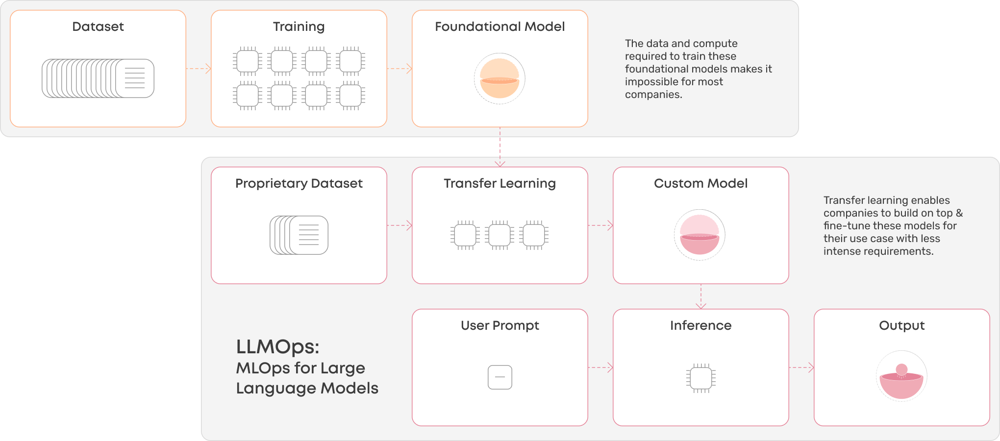

## LLMOps 介绍
LLMOps 是什么？我认为是 MLOps 的一个子类别，LLMOps 关注的是调整现有基础大型语言模型所需的运营能力和基础设施，并将这些优化后的大模型部署为产品的一部分。

下面这篇文章译自微软技术社区 [An Introduction to LLMOps: Operationalizing and Managing Large Language Models using Azure ML](https://techcommunity.microsoft.com/t5/ai-machine-learning-blog/an-introduction-to-llmops-operationalizing-and-managing-large/ba-p/3910996)，虽说微软肯定是顺便推广自己家机器学习托管服务的，但是文章质量肯定没问题，对一些概念的澄清也是专业的，故将原文翻译如下。

### 介绍
近几个月来，随着 GPT-4 等大规模语言模型的出现，自然语言处理 (NLP) 领域发生了范式转变。这些模型由于能够捕捉和理解人类语言的复杂性，在各种 NLP 任务中取得了卓越的性能。然而，为了充分释放这些预训练模型的潜力，必须简化这些模型在实际应用中的部署和管理。

在这篇文章将探讨大型语言模型的操作过程，包括提示工程和调整、微调和部署，以及与这种新范式相关的好处和挑战。

#### LLM 是如何运行的？

GPT-4 等大型语言模型使用深度学习技术在海量文本数据集上进行训练，学习语法、语义和上下文。他们采用 Transformer 架构来预测句子中的下一个单词，该架构擅长理解文本内的关系。经过训练，这些模型可以生成类似人类的文本，并根据提供的输入执行各种任务。这与经典的机器学习模型非常不同，经典的机器学习模型是使用特定的统计算法进行训练的，可提供预定义的结果。

大型语言模型在生成类似人类的响应方面优于传统的机器学习模型，因为它们能够从人类反馈中学习以及提示工程提供的灵活性。

#### LLM 在实际应用中存在哪些风险？

LLM旨在生成看起来连贯且上下文适当的文本，而不是遵循事实的准确性。这会导致以下强调的各种风险：
     
- 放大偏见：LLM可能会产生有偏见或歧视性的输出。   
- 幻觉：LLM可能会无意中生成不正确的、误导性的或虚假的信息。  
- 提示注入：坏人可能会利用 LLM 提示注入生成有害内容。
- 道德问题：LLM的使用引发了关于这些模型产生的输出的责任和责任的道德问题。

#### 如何应对LLM的风险？
1. **负责任的 AI 框架**：Microsoft 创建了非常详细的技术建议和资源，以帮助客户设计、开发、部署和使用负责任地实施 Azure OpenAI 模型的 AI 系统。我不会在本博客中深入探讨这个主题，但请访问以下链接以了解更多信息：
- [Azure OpenAI 模型的 Responsible AI 实践概述](https://learn.microsoft.com/en-us/legal/cognitive-services/openai/overview)

- [LLM的负责任的人工智能 (microsoft.com)](https://techcommunity.microsoft.com/t5/ai-machine-learning-blog/deploy-large-language-models-responsibly-with-azure-ai/ba-p/3876792)

2. **利用 MLOps 实现大型语言模型，即 LLMOps**：多年来，MLOps 已经证明了其增强 ML 模型的开发、部署和维护的能力，从而带来更敏捷、更高效的机器学习系统。 MLOps 方法可以实现模型构建、测试、部署和监控等重复任务的自动化，从而提高效率。它还促进持续集成和部署，从而实现更快的模型迭代和更平滑的生产部署。尽管 LLM 是经过预先训练的，但我们不必进行昂贵的培训，但可以利用 MLOps 来调整 LLM，在生产中有效地操作和监控它们。用于大型语言模型的 MLOps 称为 LLMOps。

### MLOps 与 LLMOps 的区别

快速回顾一下 MLOps 在经典机器学习模型中的工作原理。将 ML 模型从开发到部署再到运营涉及多个团队和角色以及广泛的任务。以下是标准 ML 生命周期的流程：

- **数据准备**：收集必要的数据，清理并转换为适合机器学习算法的格式。

- **模型构建和训练**：选择合适的算法并提供预处理数据，使其能够学习模式并做出预测。通过迭代超参数调整和可重复的管道提高模型的准确性。

- **模型部署**：打包模型并将其部署为可扩展的容器以进行预测。将模型公开为 API 以与应用程序集成。
  
- **模型管理和监控**：监控性能指标、检测数据和模型偏差、重新训练模型以及向利益相关者传达模型的性能。

有趣的是，LLM 的生命周期与上面概述的经典 ML 模型非常相似，但我们不必进行昂贵的模型训练，因为 LLM 已经经过预先训练。然而，我们仍然必须考虑调整提示（即提示工程或提示调整），并在必要时微调模型以实现特定领域的基础模型。以下是 LLM 生命周期的流程：

### 使用 Azure 机器学习进行 LLMOps

#### 数据准备
该过程的第一步是访问类似于机器学习模型的LLM数据。

#### 模型构建和训练
LLM 的一个主要优点是我们不必经历昂贵的培训过程，因为它们已经是可用的模型，如 GPT、Llama、Falcon 等。但是，我们仍然需要考虑调整提示（即提示工程或提示调整），如有必要，微调模型以实现特定领域的基础模型。

#### 基础模型托管中心
模型目录是发现基础模型的中心，例如 Azure OpenAI 模型、Llama 2、Falcon 和 HuggingFace 中的许多模型。这些模型经过 Azure 机器学习的精心策划和彻底测试，可轻松部署并与应用程序集成。

可以使用 Azure DevOps 或 GitHub 中的Notebook或 CI/CD 管道轻松部署基础模型。

请参考此链接以获取更详细的文档：
- [如何使用 Azure 机器学习策划的开源基础模型（预览）](https://learn.microsoft.com/en-us/azure/machine-learning/how-to-use-foundation-models?view=azureml-api-2)

- 带有示例的 GitHub 存储库：
[azureml-examples/sdk/python/foundation-models](https://github.com/Azure/azureml-examples/tree/main/sdk/python/foundation-models)

#### 提示流
开发高效的提示对于降低 LLM 风险和提高安全性至关重要。Azure 机器学习提示流提供了全面的解决方案，可简化原型设计、实验和调整提示工程流程的过程。以下是一些重要的功能： 

    1. 创建链接 LLM、提示和 Python 工具的可执行流程。 
    2. 通过团队协作轻松调试、共享和迭代您的流程。
    3. 创建提示变体并通过大规模测试评估其性能。

将提示流部署为实时端点以集成到工作流中。

提示流如何使用连接的构建块的可视化流程：

一旦开发了提示流，就可以轻松地将其部署为端点以集成到工作流程中。

有关提示流的更多详细文档，请参阅此链接: [什么是 Azure 机器学习提示流（预览）](https://learn.microsoft.com/en-us/azure/machine-learning/prompt-flow/overview-what-is-prompt-flow?view=azureml-api-2)

#### 检索增强生成（RAG）
降低LLM风险的另一种方法是基于特定领域的数据，以便LLM将研究该数据以给出响应。这称为检索增强生成（RAG）。 RAG 流程的工作原理是将大数据分成可管理的片段，然后创建向量嵌入，以便轻松理解这些片段之间的关系。

通过连接各种组件（例如从数据存储中提取数据、创建向量嵌入以及在向量数据库中存储向量），使用 Prompt Flows 可以轻松创建 RAG 管道。

请参阅以下有关 Azure AML 中的 RAG 功能的文档：
- [使用 Azure 机器学习管道，无需代码即可构建 RAG 管道（预览）](ttps://learn.microsoft.com/en-us/azure/machine-learning/how-to-use-pipelines-prompt-flow?view=azureml-api-2)

- [GitHub 上的RAG例子](https://github.com/Azure/azureml-examples/tree/main/sdk/python/generative-ai/rag/notebooks)

#### LLM 微调
大型语言模型的微调是一个过程，其中预先训练的模型适用于生成特定于特定领域的答案。微调使模型能够掌握与该领域相关的细微差别和上下文，从而提高其性能。微调涉及的步骤如下：
- **选择相关数据集**：选择代表您希望模型擅长的特定领域或任务的数据集，确保其具有足够的质量和大小以进行有效的微调。
- **调整训练参数**：修改学习率、批量大小、训练周期数等参数，以优化微调过程并防止过度拟合。
- **评估和迭代**：使用验证数据定期评估微调模型的性能，并进行必要的调整以提高其在目标领域的准确性和有效性。
  

有关微调的更多详细信息，请参阅[此 GitHub 存储库](https://github.com/MicrosoftLearning/advanced-gen-ai/blob/main/Instructions/04-finetune-model.md)  

### 模型部署
LLMOps 的下一阶段是将模型部署为端点，以与生产使用的应用程序集成。 Azure ML 提供高度可扩展的计算机，例如 CPU 和 GPU，用于将模型部署为容器并支持大规模推理：

- **实时推理**：它支持通过低延迟端点进行实时推理，从而在应用程序中更快地做出决策。
- **批量推理**：Azure ML 还支持异步处理大型数据集的批量推理，无需实时响应。

#### 模型管理和监控
一旦LLM模型被部署为端点并集成到应用程序中，监控这些模型以确保它们按预期运行并继续为用户创造价值就非常重要。 Azure ML 提供全面的模型监视功能，包括监视数据的漂移、模型性能和基础结构性能。

- **数据漂移**：当用于预测的输入数据的分布随时间变化时，就会发生数据漂移。这可能会导致模型性能下降，因为模型是根据历史数据进行训练的，但用于对新数据进行预测。 Azure 机器学习的数据漂移检测功能允许你监视输入数据的分布变化。这可以帮助您确定何时更新模型，并确保模型在数据环境发生变化时保持准确。

- **模型指标**：模型监控是一项综合功能，使您能够跟踪已部署模型的性能，包括准确性、延迟和其他指标。借助 Azure 机器学习，你可以设置警报和通知，以便在模型性能发生变化或超过某些阈值时通知你。这有助于您维护高质量的模型并主动解决可能出现的任何问题。

- **模型和基础设施监控**：通过对模型和基础设施的监控，我们可以跟踪生产中的模型性能，以便从模型和操作的角度进行了解。 Azure 机器学习支持使用 MLflow Tracking 记录和跟踪实验。我们可以使用 MLflow 记录模型、指标、参数和其他工件。此日志信息在 Azure App Insights 内捕获，然后可以使用 Azure Monitor 内的 Log Analytics 进行访问。由于 LLM 是经过预先训练的，我们可能无法深入了解模型推理日志，但我们可以有效地跟踪 LLM 超参数、执行时间、提示和响应。

